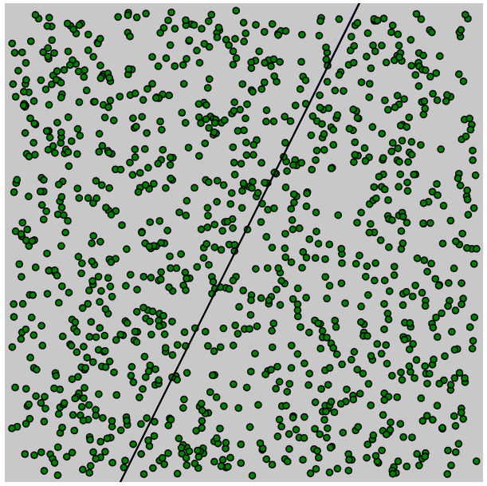

A general purpose perceptron library.

## Usage

```
// Make an object
let perceptron = new Perceptron();

// Predict
let prediction = perceptron.predict(features);

// Get loss/error.
let loss = perceptron.getLoss(label, prediction);

// If has error/loss.
if(loss)
{
   // Train
   perceptron.train(features, loss);
}
```
